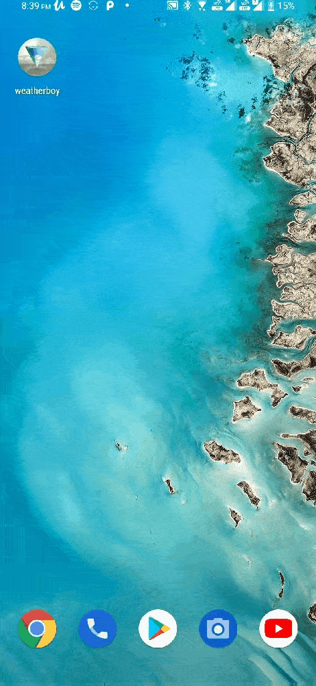

# Weather Boy
Flutter application
## App Description
**Features**
*Get live weather data at the Phone's current location with matching background and recommendation message.
*Get weather in any other city using it's name
  *The list of cities includes more than 200,000 cities

### Working of the app:
* The weather of the current location shows up on launch

* The current Weather of any city can be requested
  * The [OpenWeatherMap api](https://openweathermap.org/api "Go to Website") is used to get live weather data.
  * The name of the city is not case sensitive
  
  
  
  
  
  * Failsafe in case given city doesn't exist has been implemented
  
  
  
* Refresh the page to get back the weather of current location.

##Information
This app is based on a udemy project in the Udemy course:[complete flutter development bootcamp 2020](https://www.udemy.com/course/flutter-bootcamp-with-dart/?utm_source=adwords&utm_medium=udemyads&utm_campaign=LongTail_la.EN_cc.INDIA&utm_content=deal4584&utm_term=_._ag_77882236463_._ad_433887110815_._kw__._de_c_._dm__._pl__._ti_dsa-1007766171312_._li_1007809_._pd__._&matchtype=b&gclid=EAIaIQobChMI_pTfvLms6QIVxNeWCh3YPAr-EAAYASAAEgJ8X_D_BwE "Go to course page").

Thanks to [Pixbay](https://pixabay.com/ "Go to Website") for providing royalty free images.
